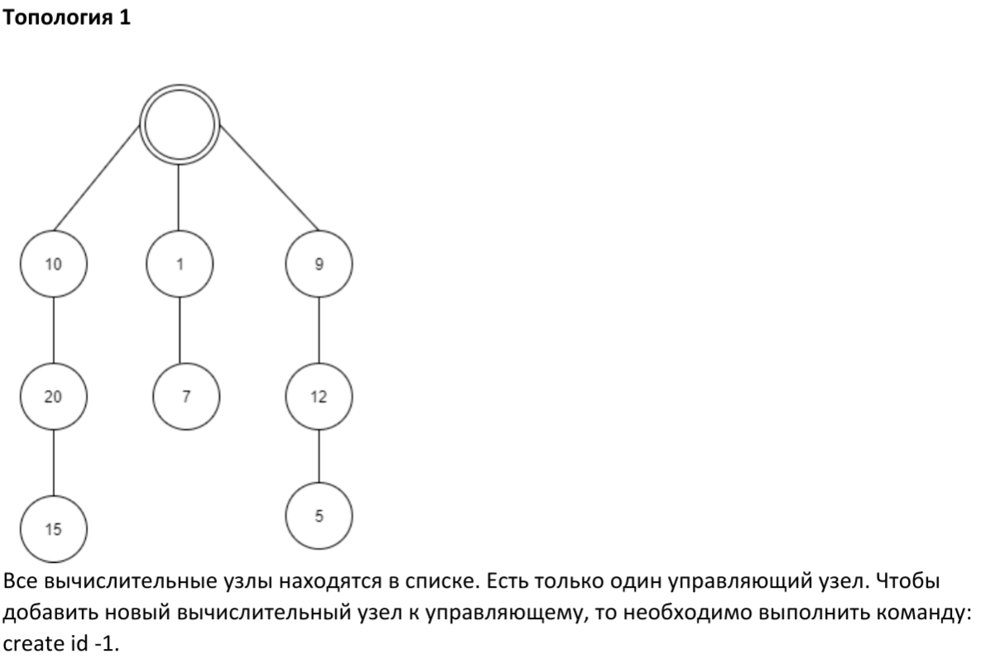

# Лабораторная работа №3
## по курсу "Операционные системы"
#### Выполнил: Юнусов Рустам М8О-310Б-22. 5 Вариант
#### Преподаватель: Миронов Евгений Сергеевич
---
## *Задание:*
Реализовать распределенную систему по асинхронной обработке запросов. В данной
распределенной системе должно существовать 2 вида узлов: «управляющий» и
«вычислительный». Необходимо объединить данные узлы в соответствии с той топологией,
которая определена вариантом. Связь между узлами необходимо осуществить при помощи
технологии очередей сообщений. Также в данной системе необходимо предусмотреть проверку
доступности узлов в соответствии с вариантом. При убийстве («kill -9») любого вычислительного
узла система должна пытаться максимально сохранять свою работоспособность, а именно все
дочерние узлы убитого узла могут стать недоступными, но родительские узлы должны сохранить
свою работоспособность.
Управляющий узел отвечает за ввод команд от пользователя и отправку этих команд на
вычислительные узлы. Список основных поддерживаемых команд:

### Используемая топология


### Набор команд
#### Набор команд 1 (подсчет суммы n чисел)
Формат команды: exec $id$ $n$ $k_1$ … $k_n$

id – целочисленный идентификатор вычислительного узла, на который отправляется команда
n – количество складываемых чисел (от 1 до 108)
k1 … kn – складываемые числа
Пример запроса:
> exec 10 3 1 2 3

Ответ:
> Ok:10: 6

### Тип проверки доступности узлов
#### Команда проверки 1
Формат команды: pingall
Вывод всех недоступных узлов вывести разделенные через точку запятую.
Пример:
> pingall

> Ok: -1 // Все узлы доступны
---
> pingall

> Ok: 7;10;15 // узлы 7, 10, 15 — недоступны

## Листинг программы

### manager.cpp
```c++
#include <iostream>
#include <map>
#include <vector>
#include <string>
#include <sstream>
#include <zmq.hpp>
#include <csignal>
#include <cstdlib>
#include <unistd.h>

std::map<int, std::string> nodes; // id -> адрес узла (tcp://localhost:port)
std::map<int, bool> available;   // id -> доступность

void create_node(int id, int parent = -1) {
    if (nodes.count(id)) {
        std::cout << "Error: Already exists" << std::endl;
        return;
    }
    if (parent != -1 && (!nodes.count(parent) || !available[parent])) {
        std::cout << "Error: Parent not found or unavailable" << std::endl;
        return;
    }

    pid_t pid = fork();
    if (pid == -1) {
        std::cout << "Error: Unable to fork process" << std::endl;
        return;
    }
    if (pid == 0) {
        std::string port = std::to_string(5550 + id);
        execlp("./node", "./node", std::to_string(id).c_str(), port.c_str(), NULL);
        exit(0);
    }

    std::string address = "tcp://localhost:" + std::to_string(5550 + id);
    nodes[id] = address;
    available[id] = true;
    std::cout << "Ok: " << pid << std::endl;
}

void exec_command(int id, const std::vector<int>& params) {
    if (!nodes.count(id) || !available[id]) {
        std::cout << "Error:" << id << ": Node is unavailable" << std::endl;
        return;
    }

    try {
        zmq::context_t context(1);
        zmq::socket_t socket(context, zmq::socket_type::req);
        socket.connect(nodes[id]);

        std::ostringstream oss;
        oss << "exec ";
        for (const auto& param : params) {
            oss << param << " ";
        }

        std::string command = oss.str();
        zmq::message_t request(command.size());
        memcpy(request.data(), command.c_str(), command.size());
        socket.send(request, zmq::send_flags::none);

        zmq::message_t reply;
        socket.recv(reply, zmq::recv_flags::none);
        std::string result(static_cast<char*>(reply.data()), reply.size());

        std::cout << "Ok:" << id << ": " << result << std::endl;

    } catch (const zmq::error_t& e) {
        std::cout << "Error:" << id << ": Node communication failed" << std::endl;
    }
}

void pingall() {
    std::vector<int> unreachable;
    for (auto& [id, address] : nodes) {
        try {
            zmq::context_t context(1);
            zmq::socket_t socket(context, zmq::socket_type::req);
            socket.connect(address);
            socket.set(zmq::sockopt::rcvtimeo, 2000);
            socket.set(zmq::sockopt::linger, 0); // try send with closed

            zmq::message_t request(4);
            memcpy(request.data(), "ping", 4);
            socket.send(request, zmq::send_flags::none);

            zmq::message_t reply;
            zmq::recv_result_t bytes = socket.recv(reply, zmq::recv_flags::none);
            if (!bytes) {
                std::cout << "Unreachable " << id << std::endl;
                unreachable.push_back(id);
            } else {
                std::string result(static_cast<char*>(reply.data()), reply.size());
                if (result != "pong") {
                    std::cout << "Unreachable " << id << std::endl;
                    unreachable.push_back(id);
                }
            }

        } catch (...) {
            available[id] = false;
            unreachable.push_back(id);
        }
    }

    if (unreachable.empty()) {
        std::cout << "Ok: -1" << std::endl;
    } else {
        for (size_t i = 0; i < unreachable.size(); ++i) {
            std::cout << unreachable[i];
            if (i + 1 != unreachable.size()) std::cout << ";";
        }
        std::cout << std::endl;
    }
    std::cout << "pingall END" << std::endl;
}

int main() {
    std::string command;
    while (std::getline(std::cin, command)) {
        std::istringstream iss(command);
        std::string cmd;
        iss >> cmd;

        if (cmd == "create") {
            int id, parent = -1;
            iss >> id >> parent;
            create_node(id, parent);
        } else if (cmd == "exec") {
            int id, n;
            iss >> id >> n;
            std::vector<int> params(n);
            for (int i = 0; i < n; ++i) {
                iss >> params[i];
            }
            exec_command(id, params);
        } else if (cmd == "pingall") {
            pingall();
        } else {
            std::cout << "Unknown command" << std::endl;
        }
    }
    return 0;
}
```

### node.cpp
```c++
#include <iostream>
#include <thread>
#include <string>
#include <zmq.hpp>
#include <csignal>

int node_id;

void process_requests(const std::string& address) {
    zmq::context_t context(1);
    zmq::socket_t socket(context, zmq::socket_type::rep);
    socket.bind(address);

    while (true) {
        zmq::message_t request;
        socket.recv(request, zmq::recv_flags::none);
        std::string command(static_cast<char*>(request.data()), request.size());

        if (command == "ping") {
            std::string reply = "pong";
            socket.send(zmq::buffer(reply), zmq::send_flags::none);
        } else if (command.rfind("exec", 0) == 0) {
            std::istringstream iss(command.substr(5));
            int n;
            iss >> n;
            int sum = 0;
            for (int i = 0; i < n; ++i) {
                int num;
                iss >> num;
                sum += num;
            }
            socket.send(zmq::buffer(std::to_string(sum)), zmq::send_flags::none);
        }
    }
}

int main(int argc, char* argv[]) {
    if (argc < 3) {
        std::cerr << "Usage: node <id> <port>" << std::endl;
        return 1;
    }

    node_id = std::stoi(argv[1]);
    std::string port = argv[2];
    std::string address = "tcp://*:" + port;

    std::cout << "Node " << node_id << " started on " << address << std::endl;
    process_requests(address);

    return 0;
}
```

## Вывод
В этой лабораторной работе реализована распределенная система с узлами двух типов: управляющий и вычислительный. Управляющий узел создает вычислительные узлы, отправляет им команды на выполнение и проверяет их доступность. Узлы взаимодействуют через очереди сообщений с использованием ZeroMQ, что позволяет передавать команды и обрабатывать их асинхронно. Система сохраняет работоспособность при сбое вычислительных узлов — недоступные узлы игнорируются, а остальные продолжают функционировать. Реализована команда exec для вычисления суммы чисел и команда pingall для проверки доступности узлов. Достаточно полезный опыт, пригодится в будущем при разработке высоконагруженных и отказоустойчивых систем.